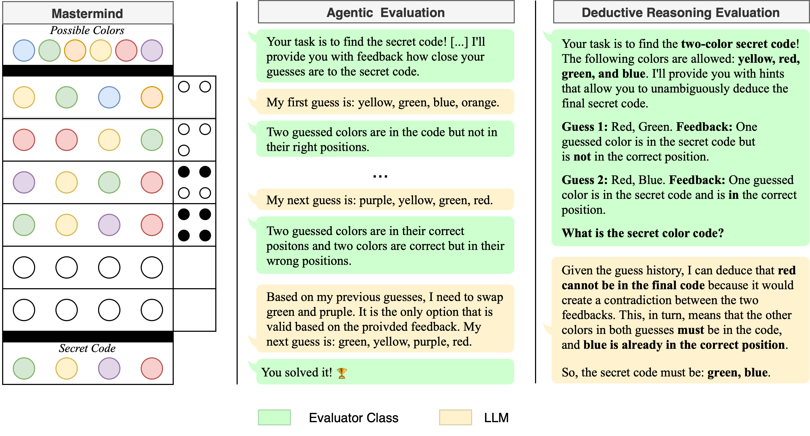

<div align="center">

# MastermindEval

Evaluating Reasoning Capabilities of LLMs Using the Mastermind Board Game.



[Installation](#🚀-installation) | [Evaluation Paradigms](#🏆-evaluation-paradigms) | [Basic Concepts](#🔑-basic-concepts) | [Running the Evaluations](#running-the-evaluations) |
[Citation](#📚-citation)

</div>

## 🚀 Installation 

To set up the environment and install dependencies, run the following:

```bash
conda create -n mastermind python=3.11
conda activate mastermind
pip install -e .
```

## 🏆 Evaluation Paradigms

We provide three different evaluation paradigms:

1. **🤖 Agentic Evaluation**: The model actively plays Mastermind, interacting with the game environment.
2. **📝 Prompt-Based Evaluation**: The model is presented with pre-played game scenarios and must deduce the last possible code.
3. **🎯 Multiple-Choice Evaluation**: The model ranks different code options based on log-likelihood, aligning with pretraining objectives. We will integrate this option into the [lm-eval-harness](https://github.com/EleutherAI/lm-evaluation-harness) library soon.

## 🔑 Basic Concepts

- **🧩 Model Class**: Defines the LLM interface that interacts with the game. We provide support for:
  - Hugging Face Model Hub
  - OpenAI
  - Anthropic
- **🎲 Mastermind Game Class**: Represents a game instance with customizable parameters such as `num_colors` and `possible_colors`.
- **📊 Evaluator Class**: Manages the evaluation process by executing multiple rounds of the game and assessing model performance.

## Running the Evaluations

We provide various scripts for running different evaluation methods:

- **🤖 Agentic Evaluation**: `run_full_game.py` (Python script) and `run_full_game.sh` (Bash script)
- **📝 Prompt-Based Evaluation**: `run_instructions.py` (Python script) and `run_instructions.sh` (Bash script) - These splits are also availabe on the 🤗 [Hugging Face hub](https://huggingface.co/collections/flair/mastermindeval-67cb01daedbee142edd594ea)!
- **🎯 Multiple-Choice Evaluation**: `run_multiple_choice.sh` (Bash) – relies on `lm-eval-harness` (pending) - These splits are also availabe on the 🤗 [Hugging Face hub](https://huggingface.co/collections/flair/mastermindeval-67cb01daedbee142edd594ea)!

### Example Usage

Below is a conceptual overview of running an evaluation using a Hugging Face model:

```python
from mastermind.evaluator import Evaluator
from mastermind.game import Mastermind
from mastermind.models import HFModel
from mastermind.utils import print_summary

# Load the model
model = HFModel(model_name='deepseek-ai/DeepSeek-R1-Distill-Qwen-7B')

# Initialize the game environment
game = Mastermind(code_length=4, num_colors=6)

# Create the evaluator
evaluator = Evaluator(game, model, use_cot=True, use_fewshot_example=True)

# Run the evaluation
result = evaluator.run(num_games=100, save_results=True, save_path="results", compute_progress=True)

# Display summary
print_summary(model, game, result, num_runs=100)
```

---

## 📚 Citation

Coming soon.

For any issues, feel free to open an issue or contribute to the repository! 🚀
